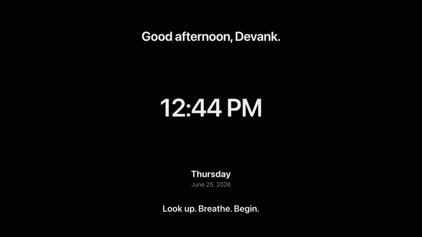
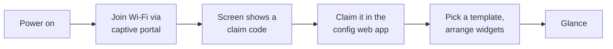

# GlanceOS

> An open platform that turns any screen into a calm, glanceable dashboard.
> Look → understand → move on.

## What it looks like

One board, several pages, rotating on the wall clock — captured from the actual **&lt;32 KB screen runtime** (not a mock):

<p align="center"></p>

Real boards rendered by the actual runtime — monochrome by design, light *and* dark, all built from the standard blocks (no bespoke art):

<table>
<tr>
<td width="50%"><br><sub><b>Team agenda</b> — your day at a glance</sub></td>
<td width="50%"><br><sub><b>Café menu</b> — two-column price list</sub></td>
</tr>
<tr>
<td><br><sub><b>Big clock</b> — a glanceable wall clock</sub></td>
<td><br><sub><b>Weather hero</b> — current conditions</sub></td>
</tr>
<tr>
<td><br><sub><b>KPI hero</b> — a metric that matters</sub></td>
<td><br><sub><b>Welcome sign</b> — lobby signage</sub></td>
</tr>
<tr>
<td><br><sub><b>Transit board</b> — next departures</sub></td>
<td><br><sub><b>Markets watchlist</b> — tickers at a glance</sub></td>
</tr>
</table>

<sub>Eight of **166** built-in starter templates. Compose your own from **221 blocks**, bind **190 integrations**, run it on any screen.</sub>

**Status:** actively developed, and running on real screens daily. **190 integrations · 221 block types · 166 starter templates · 860+ tests · 46 migrations · one container.**

**Recently shipped**

- **Alerts that reach you.** Each rule routes its alert to the wall, the in-app feed, or email. Quiet ones batch into a digest instead of interrupting, and anything nobody acknowledges escalates on its own.
- **A calendar it understands.** One-on-one vs group, whether you're the one hosting, back-to-back detection, and how much unbroken time is genuinely left in the day.
- **Rules that reason about time.** Hold a condition for N minutes before it counts; judge a trend over any window from an hour to ninety days; fire once at a threshold crossing rather than every minute after it; notice a sensor that has quietly stopped reporting.
- **Screens that explain themselves.** One view answers "what is every screen showing right now, and why", naming the rule that won.
- **Teams (v11).** Organisations, roles, invitations, and shared boards bound to live team data.
- **Multi-page boards (v10).** A board rotates through its own pages on a schedule, each with its own dwell and timing — this replaced the old per-device playlists.

Architecture decisions through v9.7 are recorded in [docs/DECISIONS.md](docs/DECISIONS.md); the commit history carries everything since.

## The idea

Screens are everywhere — spare monitors, the TV in a clinic waiting room, old tablets, tiny e-paper panels — and almost all of them are either dark or showing something that wants your attention. GlanceOS makes them useful and quiet: a black-and-white, type-first dashboard showing exactly what you chose, configured entirely from a web app. The device itself has **no settings, no menus, no apps, no scrolling**. Plug it in, put it on Wi-Fi, claim it with a short code, done.

```
┌────────────────────────────────────┐
│  Thu, Jun 12                17:42  │
│                                    │
│  10:00  Class                      │
│  14:00  Project meeting            │
│                                    │
│  26°C clear           Tasks        │
│                       • Finish HW  │
│                                    │
│  Light ON             Fan OFF      │
└────────────────────────────────────┘
```

Same platform, different glass: a personal dashboard on a desk monitor, a queue board in a waiting room, a battery-powered e-paper panel that updates every fifteen minutes.

## Principles

1. **The server is the source of truth.** Screens are dumb glass — they render what they're told. Dumb, not amnesiac: a screen caches its last state, so a Wi-Fi blip never blanks a wall display.
2. **Calm by default.** Black and white, typography-first, no animations, no notifications, no feed. If it doesn't help a two-second glance, it doesn't exist.
3. **One schema, many renderers.** A layout is a document. The same document renders as live DOM on a TV and as a 1-bit image on e-paper.
4. **Plug and play, genuinely.** Power → Wi-Fi → claim code → your dashboard. Nothing is ever configured on the device.
5. **Yours.** Self-hosted in one container. MIT licensed. No account with anyone, no subscription, no telemetry.

## How it works



One server process owns devices, layouts, and widget data (calendar, weather, tasks, Home Assistant). Screens subscribe over plain HTTP (SSE) and render. Battery e-paper devices poll for a pre-rendered 1-bit image instead. The full design is in [docs/ARCHITECTURE.md](docs/ARCHITECTURE.md).

## What's in it

**The Studio.** A Notion-style document editor: a new board opens with the title ready and you just type — click any text and the cursor drops in, Enter starts a new line, there is no "object" to insert. Or reach for one of **221 block types** (text, lists, tables, charts, calendars, gauges, clocks, countdowns, trackers, signage). Many run on their own once placed: a live pomodoro, a sun-arc, a **My Day** digest, **Up Next** agendas, a **Focus now** hero, a **Leave by** countdown computed from your own travel time — no maps cloud. Blocks resize from their edges or a corner grip, drag by the ⠿ handle, and form columns when dropped alongside. Multi-select, cross-board copy/paste, paint-format, present mode, and a `?` shortcuts overlay. The live preview *is* the real screen renderer in an iframe, and edits autosave to connected screens over SSE.

**Live data.** Any chart, stat, list or calendar binds to a source from the **⟿ Data** tab — a connected app or any public URL — and falls back to its typed-in values offline. Connect apps once on the Integrations page: tokens are AES-256-GCM encrypted server-side and never returned, with live connection-health badges. Token apps (Todoist, GitHub, Notion, Linear, Asana, Jira, Trello), iCal/CSV/RSS URLs, Home Assistant and Prometheus on your LAN, and self-registered OAuth apps with PKCE + refresh (Google Calendar, Microsoft 365, GitHub, Notion, Spotify, Slack). Upload a CSV and it becomes a source like any other.

**Context.** Automations sense the sun, the weather, your calendar, a value's trend or staleness, and presence — per household member — and switch boards on their own. A rule can require a condition has held for N minutes, or fire an action N minutes later.

**Any screen.** **TV / kiosk mode** gives true fullscreen with a wake lock, overscan-safe margins, D-pad navigation with a 10-ft focus ring, burn-in pixel-shift, and a wake/sleep schedule. Cast a board to a Chromecast with your own Cast App ID — it flings the read-only share link, never a device secret. Thin native shells under [`devices/`](devices/) cover Raspberry Pi, Android TV / Fire TV, Tizen, webOS and tvOS; each just loads the web runtime and pairs by the on-screen QR. Nothing renders on the device.

**Signage.** Display groups share a default board and a time-of-day schedule, a screen falling back to its group only when it has no board of its own. Push fleet commands to every live screen at once, log proof-of-play and export a per-group CSV, and split a board into positioned multi-zone regions.

**Sharing.** Any board can go out as a public read-only link with optional expiry and password, with a scannable QR and PNG export.

**Ops & security.** `/health` and `/ready`, a CSP, CSRF double-submit tokens, and an SSRF guard that resolves and validates every outbound hop — redirects, IPv4-mapped IPv6, and DNS rebinding via a pinned dispatcher. Trusted-proxy rate-limit keys, share passwords by POST and signed cookie rather than the URL, secret-key rotation with a previous-key fallback, boot-time config validation, upload quotas and disk GC.

**Self-hosting.** A hardened non-root Docker image with a healthcheck and a baked Chromium; CI publishes a multi-arch `ghcr.io` image, so it is `docker compose up -d` with no clone-and-build. SQLite and a single process are the zero-config default; setting `GLANCEOS_REDIS_URL` fans SSE and rate limits across replicas ([docs/SCALING.md](docs/SCALING.md)).

The frontend is a fast-by-structure shell (~19 kB gzipped first load; the Studio lazy-loads on idle), emoji-free throughout — one bespoke monochrome icon per block — correct in light and dark, with the screen runtime held under a CI-gated 32 kB.

## Running it

```sh
corepack enable   # once — provides pnpm
pnpm install
pnpm dev          # server :8080 · screen :5173 · config :5174
```

Open <http://localhost:5173> on anything with a browser — it registers itself and shows a claim code. Open <http://localhost:5174>, create your account (first visit), enter the code, pick a setup, and the screen flips live. Click any screen to open the **Studio**: double-click anywhere to type, or drag blocks from the categorized palette by their top ⠿ handle (the drop line and halo show where they land — block edges make columns); drag a column seam or a row's bottom edge to resize; press `/` to insert, arrows reorder, ⌘Z undoes whole gestures — every change autosaves to connected screens. `pnpm test` runs the suite.

**Upgrading a v0.1 install:** the migration moves your screens, setups and old password onto a single `admin@local` account. That isn't a valid sign-in address, so give it a real one first — this also sets a new password and takes effect on a running server:

```sh
pnpm --filter @glanceos/server passwd admin@local --email you@example.com
```

(Self-hosting publicly? `GLANCEOS_REGISTRATION=closed` stops strangers registering; the first account is always allowed.)

### Run it (one command)

Self-host the whole thing — one container, one SQLite file, no cloud, no account with anyone:

```sh
docker compose up -d        # pulls ghcr.io/devank-yadav/glanceos
```

Then open <http://localhost:8080>, create your account, and claim any screen. (Prefer plain Docker? `docker run -d -p 8080:8080 -v glanceos-data:/data ghcr.io/devank-yadav/glanceos`.) Images are published multi-arch (amd64 + arm64), so the **same image runs on a Raspberry Pi**. Building from source instead: `pnpm build && pnpm --filter @glanceos/server start` serves everything from one process — config app at `/`, screens point at `/screen` — or `docker build -t glanceos .`.

**Host it online:** ready-made configs for **Fly.io** (`fly.toml`) and **Render** (`render.yaml`) ship in the repo, alongside Compose and any-Docker-host instructions — see **[docs/DEPLOY.md](docs/DEPLOY.md)** (port 8080 + a `/data` volume + `GLANCEOS_PUBLIC_URL` is the whole contract).

## Honest comparison

| Project | What it is | Where this differs |
|---|---|---|
| [TRMNL](https://usetrmnl.com) | Polished e-ink dashboard, open firmware | Its server is the paid product. GlanceOS is the same idea built fully open: server-rendered 1-bit images, an open [device protocol](docs/DEVICE-API.md), in-board page rotation, and polling-URL plugins — and the *same board* also runs live in any browser, not just on e-paper. |
| [DAKboard](https://dakboard.com) | Hosted wall-display service | Subscription, closed, cloud-dependent. This is one self-hosted container — no rent. |
| [MagicMirror²](https://magicmirror.builders) | DIY smart-mirror framework with a huge module community | Configuration lives in files on each device. Here devices are dumb glass and everything is configured from one web app. |
| [FullPageOS](https://github.com/guysoft/FullPageOS) | Raspberry Pi image that boots into a URL | That's the bootloader half of the story. This pairs the kiosk image with the platform it boots into. |
| [Anthias](https://github.com/Screenly/Anthias) | Open digital-signage player | Plays media and URL loops. This renders structured live widgets from one schema — the same layout on a TV or a 1-bit e-paper panel. |
| Nest Hub / Echo Show | Smart displays | Feeds, ads, assistants, lock-in. The whole point here is the absence of that. |

The wedge, in one line: **a fully open server + claim-code plug-and-play + one schema spanning live screens and e-ink + actions, not just passive glass.**

## Repo map

| Path | What will live there |
|---|---|
| [`apps/server`](apps/server) | The platform daemon — API, SSE hub, widget data fetchers, SQLite, render pipeline |
| [`apps/screen`](apps/screen) | The dashboard runtime every screen displays (vanilla TS, old-TV-browser safe) |
| [`apps/config`](apps/config) | The web app where everything is configured (Preact) |
| [`packages/schema`](packages/schema) | The layout/widget schema — the contract everything else obeys |
| [`devices/pi-image`](devices/pi-image) | Bootable Raspberry Pi kiosk image ("the OS" part) |
| [`devices/esp32-eink`](devices/esp32-eink) | Battery e-paper firmware |
| [`docs/`](docs) | Architecture, roadmap, learning path, decision log, [device API](docs/DEVICE-API.md), [platform support tiers](docs/PLATFORMS.md), [press kit](docs/PRESS.md) |

## Roadmap snapshot

| Phase | Ships | Status |
|---|---|---|
| P0 | Orientation, prior-art teardown, this repo | done |
| P1 | TypeScript foundations (mini-builds that feed the repo) | reworked — see the mode note in LEARNING-PATH |
| P2 | Platform: server + screen runtime + config studio, working in any browser | ▶ v0.2 shipped (accounts, studio, hub) — TV-browser demo left |
| P3 | Bootable Pi kiosk image with Wi-Fi provisioning | next |
| P4 | Integrations, fleet & accounts (v1.4): 5 OAuth providers, scheduling, alerts, Fleet, rich text, image upload, account page, share expiry/password, ops hardening | ✓ shipped |
| P4+ | Completion (v1.5): 4 more providers (Asana/Jira/Trello/Slack) + Notion filter builder, secret-key rotation, share QR, backup **restore**, per-board font scale, upload quota/GC, onboarding wizard, app-wide breadcrumbs, i18n scaffold | ✓ shipped |
| P4++ | Connect to the Big Screen — v1.6 (SSRF/CSRF/share-pw/rate-limit fixes, scale & Docker hardening) + v1.7 (TV kiosk: fullscreen, overscan, D-pad nav, burn-in, wake/sleep, scan-to-pair QR) + v1.8 (Chromecast casting) + v1.9 (digital signage: display groups, group scheduling, fleet commands, proof-of-play, multi-zone) + v2.0 (native shells: Pi kiosk / Android TV / Fire TV / Tizen / webOS / tvOS + platform identity + opt-in Redis scale seam) | ✓ v1.6–v2.0 shipped — program complete |
| P5 | UI overhaul (v2.1): design-system tokens + dark-mode fixes, a11y focus + responsive, and an emoji→icon sweep (bespoke icon per block + screen glyphs, CI size gate) | ✓ shipped |
| P5 | E-ink runtime: render pipeline, device protocol, page rotation | ▶ shipped (1-bit BMP render + BYOS protocol); real ESP32 firmware next |
| P5+ | **Connected & reactive (v3.0):** board sharing (read/write), scoped `Bearer` API keys + public API, a reactive layer (custom-data store, webhook inlets, an eval-free automation engine, live SSE alerts), and a mobile PWA | ✓ shipped |
| P5++ | **Simpler & calmer (v4.0):** the whole app re-organized to **3 destinations** (Boards · Screens · Settings), every on-screen object given a unique editable **name**, and an iPhone-**Shortcuts**-style automation builder in the Studio that reads + sets a board's named objects | ✓ shipped |
| P5+++ | **Polish + depth (v4.1–v4.3):** live board previews on every card, an Objects (layers) panel, and a deeper automation builder — show/hide-object, increment/toggle-data, delay, between/regex conditions, per-action enable, starter templates, Run-now / Duplicate / Run-history (ReDoS-guarded) | ✓ shipped |
| P5++++ | **Template gallery + UX polish (v4.4):** 50 ready-made full-page board designs across 8 themes ("Start from a template", one-click → editable copy; zero screen-runtime cost), redesigned board tiles, and calmer chrome (Templates in the sidebar, Import in Settings, consistent "Edit" actions) | ✓ shipped |
| P5⁵ | **Consistent tiles + community templates (v4.5):** the live-preview tile language extended to Screens and the gallery (viewport-gated so it never flickers); **publish your own board** as a template — reviewed before it joins the gallery; View→Copy preview flow; the change-content picker shows board previews | ✓ shipped |
| P5⁶ | **Automatic & smart objects (v4.7–v5.0):** dead text-boxes revived as self-running objects, signage bound to live data, "Make it live"; then a **sensing substrate** — automations read the **sun**, **weather** and **presence** and auto-switch boards — plus fusion objects (My Day, Up Next, Health ring, Home tile) and new sources (OSRM commute, Gmail/Outlook, Fitbit/Oura) | ✓ shipped |
| P5⁷ | **Effortless automations + modern location (v6.0):** the builder drops id-typing — **smart pickers** (screen/board dropdowns; object → property → value per type) and a plain-English condition catalog; an **`interval`** trigger + a 24-scenario "when" gallery + a **50-recipe** gallery; **~70** controllable object types; and a modern location story — an account **home**, **city-search sets the clock**, one-tap **"use my location"** (reverse-geocoded), and a Location control replacing raw lat/long (migration 019) | ✓ shipped |
| P5⁸ | **Calm at rest + a soul (v6.1):** a **calm crossfade** that refreshes only the blocks that changed (no full-screen flash, self-running widgets preserved); board **Looks** (editorial/terminal/grotesk/stencil), **auto** day/night by the sun, and a soft **quiet-hours dim**; the sensing substrate grows — per-automation **cooldown**, **trend** sense (is rising/falling/steady), **calendar** context, and derived **transforms** (round/currency/duration/words); a shared link **unfurls** with a board image (`/s/:token` OG); e-ink **ETag/304 + adaptive refresh** and a **battery "~N days left"** forecast; and a **pick-a-vibe** first run (migrations 020–021). **v6.1.1** patches 11 review findings — live calendar context, quiet-hours round-trip, trend on every trigger, no theme-class leaks onto idle screens, protected-image cache safety, flat-poll battery accuracy (migration 022), and the pick-a-vibe onboarding now greets every new account | ✓ shipped |
| P5⁹ | **Knows your day (v7.0):** the latent context-aware engine made felt — **Focus now** + **Leave by** glance blocks (the one thing now / when to move, no maps cloud); engine power-ups — a condition can be **sustained** (held for N min), a value can go **stale**, and any action can be **deferred** N min; one-tap calendar/trend recipes; **per-household presence** lanes; a **render seatbelt** (one bad block can't blank the wall); the homepage is now the **real < 32 kB runtime** demo (no signup); and self-hosting is a **multi-arch `ghcr.io` image** → `docker compose up -d` (no migration) | ✓ shipped |
| P6 | Open-source launch: CI releases, docs site | — |

Details, exit criteria, and the honest hour estimates: [docs/ROADMAP.md](docs/ROADMAP.md).

## Contributing

This is a learning build — the codebase doubles as my study material and I rework parts of it as I learn (see the mode note in [docs/LEARNING-PATH.md](docs/LEARNING-PATH.md)), so I'll mostly decline PRs before 1.0. Issues, ideas, and prior-art pointers are very welcome. No support promises; maintained as energy allows.

See [CONTRIBUTING.md](CONTRIBUTING.md) for local setup + the house rules (forks welcome), [SECURITY.md](SECURITY.md) for private vulnerability reporting, and [CHANGELOG.md](CHANGELOG.md) for the release history.

## License

[MIT](LICENSE).
