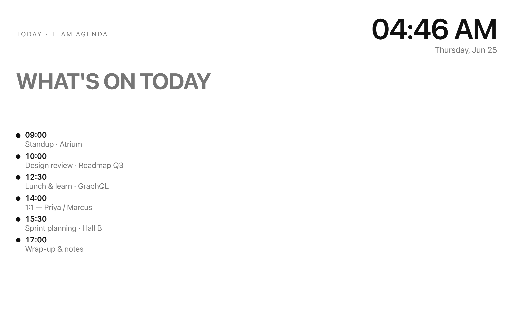
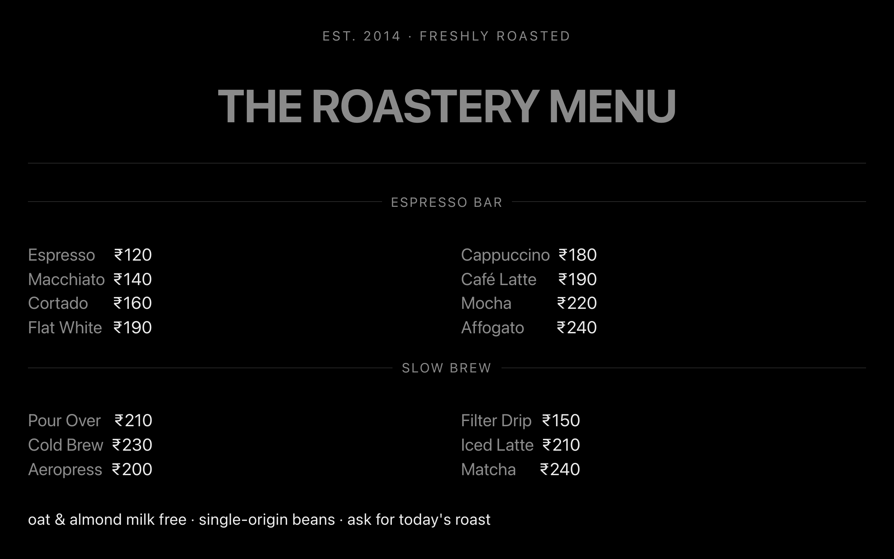
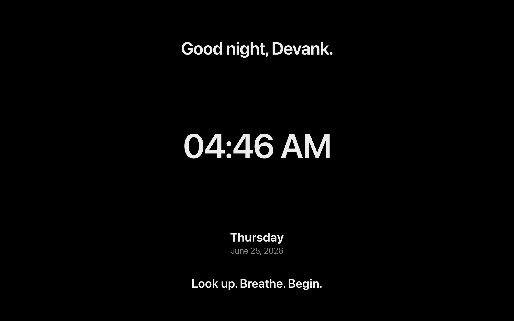
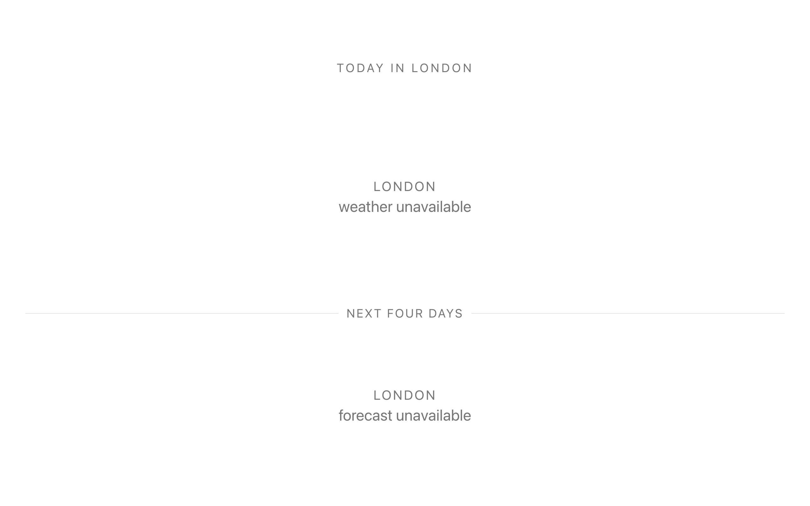
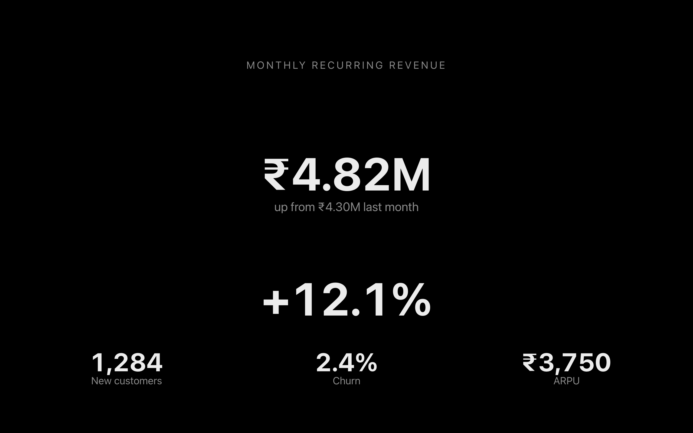
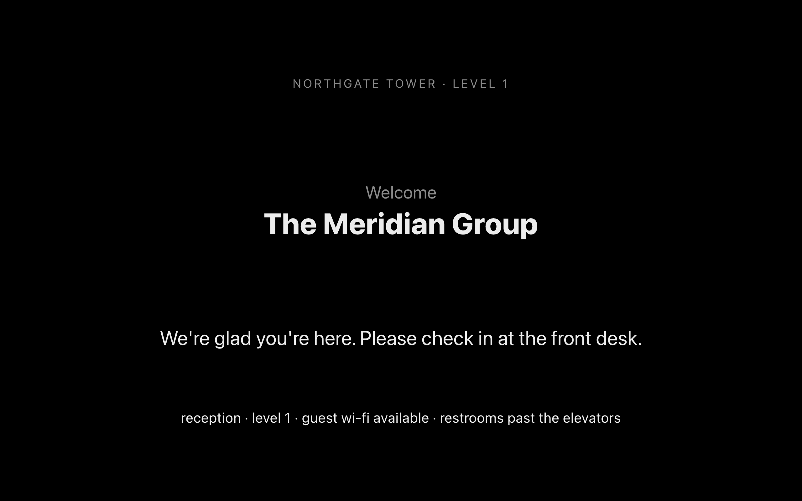
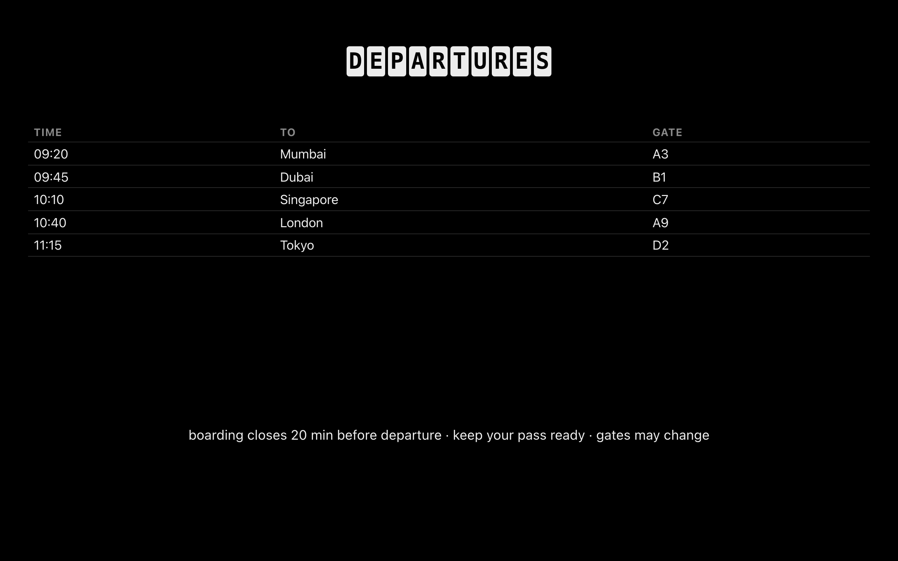
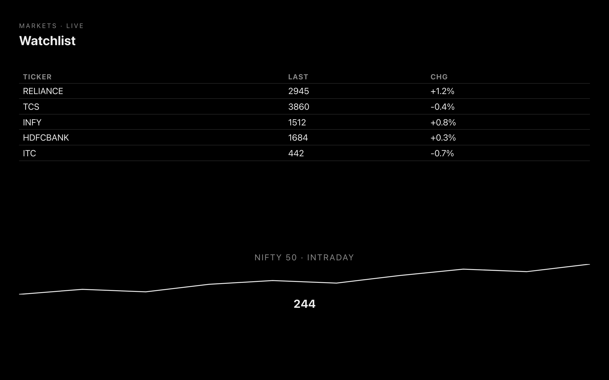
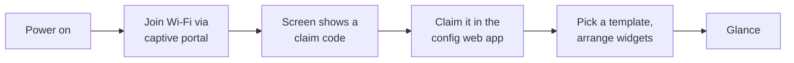

# GlanceOS <sub>(working title)</sub>

> An open platform that turns any screen into a calm, glanceable dashboard.
> Look → understand → move on.

## What it looks like

Real boards rendered by the actual **&lt;30 KB screen runtime** — monochrome by design, light *and* dark, all built from the standard blocks (no bespoke art):

<table>
<tr>
<td width="50%"><br><sub><b>Team agenda</b> — your day at a glance</sub></td>
<td width="50%"><br><sub><b>Café menu</b> — two-column price list</sub></td>
</tr>
<tr>
<td><br><sub><b>Big clock</b> — a glanceable wall clock</sub></td>
<td><br><sub><b>Weather hero</b> — current conditions</sub></td>
</tr>
<tr>
<td><br><sub><b>KPI hero</b> — a metric that matters</sub></td>
<td><br><sub><b>Welcome sign</b> — lobby signage</sub></td>
</tr>
<tr>
<td><br><sub><b>Transit board</b> — next departures</sub></td>
<td><br><sub><b>Markets watchlist</b> — tickers at a glance</sub></td>
</tr>
</table>

<sub>Eight of **159** built-in starter templates. Compose your own from **213 blocks**, bind **165 integrations**, run it on any screen.</sub>

**Status: v9.7 — "Integrations: 165 data sources"** (a big expansion of what a board can pull from — **63 new integrations** (Reddit, Bluesky, Mastodon, DEV.to, npm, GitLab, Sentry, Vercel, Stripe, YNAB, Plausible, ClickUp, Airtable, Strava, Last.fm, Plex, CoinGecko, USGS, TVmaze and many more), bringing the catalog to **165 providers** across 31 categories. Each is a server-side provider (zero screen-runtime cost) that any list/stat/chart binds to from the **⟿ Data** tab; **~96 work with no login at all** (keyless public APIs), the rest paste a token or sign in via OAuth. Many ship one-click **preset objects** — on **Settings → Connections**, search the catalog and click a `+ <object>` chip to drop a ready-to-bind block onto a board. See [docs/INTEGRATIONS.md](docs/INTEGRATIONS.md). On top of **v9.6 "Studio: keyboard resize, equalize & list-row tools"**: hold **⌥ and press the arrows** to resize the selected object — ↕ height, ↔ width (sum-preserving, one undo step); **Equalize column widths** in a multi-column row from the block menu or the multi-select bar; in any list/to-do **⌘D duplicates** a row and **⌘⌫ deletes** it; a faint **+ between rows** opens the block menu right there; and **recently-used blocks** now head the docked palette too. On top of **v9.5 "Studio: corner resize, recents & drag-reorder"**: resize any object from a **bottom-right corner grip** — width and height at once; the slash menu opens with a **Recent** section of the blocks you reach for most; drag any list / to-do row **by its marker to reorder** it, while a tap still ticks a checkbox; and **right-click the empty board** for a quick **Paste · Select all · Add block** menu. On top of **v9.4 "Studio: draggable panels + quick wins"**: the Options / Live-data panels are now **draggable** by their header (with a scrolling body that always fits the viewport), **⌥-drag** a block to duplicate it, **right-click** any object for its menu, the multi-select bar gains **lock + invert**, and deleting shows an **undo toast**. On top of **v9.3 "Studio: multi-select polish"**: **⌘A** selects every object, **Shift-drag** the marquee to *add* to a selection (a live "N selected" pill follows the cursor), and when 2+ objects are selected a calm floating bar offers **align · duplicate · delete** all at once; **double-click** any non-text object jumps straight to its Options. On top of **v9.2 "Studio: drag-select"**: drag a box across the empty board to **rubber-band select** every object it touches — a crisp indigo marquee with each covered object live-highlighted, then they're all selected at once. On top of **v9.1 "Studio polish: object presets + clean drag"**: one-click object **looks** — **Plain / Card / Outline / Filled** set padding, border, corners and background in a single tap from the Design panel; and dragging is calm end-to-end now — no heavy overlay, the drop-line snaps to its target instead of morphing, and moving a block leaves a clean board with no lingering selection chrome. On top of **v9.0 "Edit (almost) every object in place"**: the audit-driven pass that makes in-place editing the native behaviour for nearly every text object: **multi-field** blocks (definition term+meaning, price tag, event banner, profile card…) edit each part directly; **two-column lists** (key/value, opening hours, menu, timeline, FAQ, glossary, directory…) edit per row; and every list — bullet/numbered/**checklist**/steps — gets a discoverable **"+ add item"** affordance, with an empty list seeding a row to click into instead of being a dead block. The block-drag is now calm — just a thin drop-line and a faint ghost of what you're moving, no floating card, halo box, or whole-board dim. Blocks that are computed or live (clocks, charts, gauges, weather, feeds) keep their config in the Options panel. No migration. On top of **v8.1 "Studio Pro: designable objects + pro composition"**: every block takes optional **padding, border, corner-radius, background-tint and text size** so objects read as cards rather than fixed templates; **marquee** rubber-band selection, **lock** a block (no accidental moves/resizes), and **paint-format** — ⌘⇧C / ⌘⇧V copy a block's style onto many. On top of **v8.0 "edit it like you mean it"**: the Studio edits *in place*: click the text inside any object — headings, text, quotes, stats, lists, to-dos, **tables** — and just type, with a steady native cursor and no floating panel; select a block for **resize grips** at its edges; a PowerPoint-style **Layout** picker arranges the board into sections; and content **rotates** — a slideshow/**deck** block makes any section cycle through slides, and a board-wide **spotlight** moves a calm emphasis across objects. All additive — schema v3, no migration, the screen runtime stays zod-free and under the 30 kB gzip gate. Earlier, **v2.2 — dashboard, screens & studio overhaul** (a UI bug-fix + feature pass on top of v2.1: the main dashboard shows a **live mini-render** of what each screen is displaying — with "Not connected" / "No screen yet" states; modals render through a portal so they always centre cleanly; notifications fire on real events (claimed · content changed · back online · integration errors); each screen takes a **location by city search** that weather/sun blocks inherit and a **timezone from a dropdown** with an account default; and the Studio drops its floating blocks panel for one docked, opaque, scannable palette, adds a **"Display on…"** screen multi-select, and configures **tasks/queue per block**. On top of v2.1's design-system pass: dark mode perfected, accessibility + responsive fixes, and **every emoji replaced with a bespoke monochrome icon** — a custom icon for all 213 block types, plus SVG glyphs for the on-screen moon/season/rating/check widgets so nothing dithers on e-ink/TV). Blocks are no longer static: a chart, stat, list, or calendar can be **bound to a live source** — a connected app (Todoist, GitHub, Notion, Linear), a calendar's secret iCal URL (Google/Apple/Outlook), a published Google Sheet, or any REST/JSON/GraphQL/RSS URL — and the server resolves it (tokens encrypted at rest, every outbound fetch SSRF-guarded). Editing happens **on the board**: single-click a block for a floating toolbar (edit · change type · ⟿ connect data · options · delete); the ⠿ handle still moves it. **A screen can also be a battery e-paper panel:** the server renders the live board to a **1-bit BMP** (headless Chromium → Floyd–Steinberg dither) and a tiny documented [device protocol](docs/DEVICE-API.md) hands it that image plus a refresh interval — register once, poll on each wake, deep-sleep. Devices report battery/signal/firmware to a **fleet dashboard** with per-screen refresh control and an inline e-ink preview. **Playlists** rotate a screen through several setups on a schedule; a **polling-URL block** turns any JSON API into a calm tile with a safe `{{template}}` (no code, no key). All self-hosted, MIT, our own implementation — no cloud.

A liquid-glass monochrome frontend throughout — a public home page, glass chrome, and a fast-by-structure shell (≈19 kB gzipped first load; the Studio lazy-loads and prefetches on idle; the server gzips and caches hashed assets forever). The Studio is a **Notion-style document editor**: a new board opens with a title line ready and you just **type** — click any text block and the cursor drops in, a printable key starts editing a selected block, Enter starts a new paragraph, no "object" to insert — or pick from **213 block types** (text, lists, tables, charts, calendars, gauges, clocks, countdowns, trackers, signage, novelty) — many of which **run on their own once placed**: a live pomodoro/stopwatch/counter, an on-air sign, a sun-arc, a full-moon countdown, a **My Day** digest (greeting + date + weather), **Up Next** / **Day Timeline** agendas, a **Focus now** hero (the one thing to do now) and a **Leave by** countdown (next event minus your own travel time — no maps cloud), a **Health ring** and a **Home tile** — and any stat/sensor/signage block can be made **live** (one click) to update itself from a source. The display is also **context-aware**: automations can sense the **sun** (sunrise/sunset), **weather** ("if it's raining…"), the **calendar** ("my next meeting is within 10 min"), a value's **trend** (rising/falling) or going **stale**, and **presence** (arrive/leave home — per **household member** too) and auto-switch boards — and can require a condition has **held for N minutes** or fire an action **N minutes later**, plus **live** tiles fetched server-side from free keyless sources (forecast, wind, UV, air quality, RSS & Hacker-News headlines, currency, crypto, Wikipedia, quote/fact of the day, GitHub, holidays, the ISS) and a **polling-URL block** for any JSON API, all degrading to a calm placeholder offline. Power-user tools: multi-select, copy/cut/paste across boards, duplicate, line move/duplicate, per-block emphasis (invert + align), board vertical alignment, present mode, zoom, and a `?` shortcuts overlay. Blocks live on lines at natural heights (resize a row's bottom edge or a column seam), drag by the top ⠿ handle with a drop line and halo, and dropping beside a block makes columns. The live preview *is* the real screen renderer in an iframe; edits autosave to connected screens over SSE. Any chart/stat/list/calendar can be **bound to a live data source** from the ⟿ Data tab — a connected app or a public URL — with a live preview; bound blocks fall back to their typed-in props offline. Text blocks do **safe inline markdown** (bold/italic/links) and you can **upload images**; any block can be set to show **only when its data source has data**. Connect apps once on the **Integrations** page (tokens are AES-256-GCM encrypted server-side and never returned, with live **connection-health** badges) — token apps (Todoist, GitHub, Notion, Linear, **Asana**, **Jira**, **Trello**), iCal/CSV/RSS URLs, **Home Assistant**, and self-registered **OAuth** apps (authorization-code + PKCE + refresh): **Google Calendar**, **Microsoft 365 / Outlook**, **GitHub**, **Notion**, **Spotify**, **Slack** — and Notion sources get a **visual filter builder**. **Every text object edits in place** — headings, text, quotes, stats, lists, to-dos, and **tables** — click the text and type, no floating panel; select a block for **resize grips** at its edges, pick a **Layout** to arrange the board into sections, drop a **deck** to make a section rotate through slides, or turn on a board **spotlight** to cycle a calm emphasis. The whole app has **light / dark / system** theming, and any board can be shared as a **public read-only link** with optional **expiry + password**. Run a fleet of screens: **time-of-day / day-of-week schedules**, **offline + low-battery alerts** (a sidebar bell), a **Fleet dashboard**, and per-device **e-ink dither** options. Multi-user accounts with an **account page** (rename, change password, log out everywhere, JSON backup **and restore**, delete) and a **template hub**; a fresh account gets a **first-run onboarding wizard**, and every page carries an app-wide **breadcrumb**. A share link also offers a scannable **QR code** (+ PNG export); each board has a **font scale** (small/medium/large). Ops & security: `/health` + `/ready`, a CSP, **CSRF** double-submit tokens, an **SSRF guard** that resolves + validates every outbound hop (incl. redirects, IPv4-mapped IPv6, and DNS-rebind via a pinned dispatcher), **trusted-proxy** rate-limit keys, share passwords sent by POST + signed cookie (never the URL), **secret-key rotation** (`rotate-secrets` + a previous-key fallback), opt-in JSON request logging, boot-time config validation + an `.env.example`, staggered fleet pushes + WAL upkeep, an **upload quota** + disk GC, and a config-app **i18n** scaffold. Ships as a hardened **non-root Docker** image with a healthcheck and a baked Chromium. Any screen can run in **TV / kiosk mode** (`?tv=1` or a per-device toggle): true fullscreen + screen wake-lock, **overscan-safe** margins, **D-pad / remote** spatial navigation with a 10-ft focus ring, **burn-in** pixel-shift, a **wake/sleep** schedule (the panel goes to a faint clock outside hours), and a couch-readable **scan-to-pair QR** on the claim screen — all degrading cleanly on older smart-TV browsers. You can also **cast a board to a Chromecast** (opt-in with your own Cast App ID — it flings the read-only share link, no device secret over the wire). Run it as **digital signage**: organise screens into **display groups** that share a default board, playlist, and time-of-day schedule (a screen falls back to its group only when it has no board of its own); push **fleet commands** (reload / identify / clear-cache) to every live screen in a group at once; log **proof-of-play** from each screen and export a per-group **CSV** report; and split a board into positioned **multi-zone** regions, each with its own content. And it runs on the **living-room hardware** you already own: thin **native shells** under [`devices/`](devices/) — Raspberry Pi kiosk, Android TV / **Fire TV**, Samsung **Tizen**, LG **webOS**, Apple **tvOS** — each just loads the web runtime fullscreen (`?tv=1&platform=…`), pairs by the on-screen QR, and reports what it's running to the fleet; nothing renders on the device. For bigger deployments there's an **opt-in horizontal-scale seam** (set `GLANCEOS_REDIS_URL` to fan SSE + rate limits across replicas; SQLite + single-process stay the zero-config default — see [docs/SCALING.md](docs/SCALING.md)). The whole UI is **emoji-free**: a coherent custom icon set (one bespoke icon per block, monochrome SVG glyphs on the screens), dark mode is correct end-to-end, and the screen runtime stays under a CI-gated 30 kB. CI publishes a **multi-arch `ghcr.io` image** (amd64 + arm64), so self-hosting is `docker compose up -d` — no clone-and-build. **540+ tests** (incl. the `apps/screen` suite), CI on every push, one container. The Pi kiosk image (P3) and real e-ink firmware (P5) are next; the study plan lives in [docs/LEARNING-PATH.md](docs/LEARNING-PATH.md).

## The idea

Screens are everywhere — spare monitors, the TV in a clinic waiting room, old tablets, tiny e-paper panels — and almost all of them are either dark or showing something that wants your attention. GlanceOS makes them useful and quiet: a black-and-white, type-first dashboard showing exactly what you chose, configured entirely from a web app. The device itself has **no settings, no menus, no apps, no scrolling**. Plug it in, put it on Wi-Fi, claim it with a short code, done.

```
┌────────────────────────────────────┐
│  Thu, Jun 12                17:42  │
│                                    │
│  10:00  Class                      │
│  14:00  Project meeting            │
│                                    │
│  26°C clear           Tasks        │
│                       • Finish HW  │
│                                    │
│  Light ON             Fan OFF      │
└────────────────────────────────────┘
```

Same platform, different glass: a personal dashboard on a desk monitor, a queue board in a waiting room, a battery-powered e-paper panel that updates every fifteen minutes.

## Principles

1. **The server is the source of truth.** Screens are dumb glass — they render what they're told. Dumb, not amnesiac: a screen caches its last state, so a Wi-Fi blip never blanks a wall display.
2. **Calm by default.** Black and white, typography-first, no animations, no notifications, no feed. If it doesn't help a two-second glance, it doesn't exist.
3. **One schema, many renderers.** A layout is a document. The same document renders as live DOM on a TV and as a 1-bit image on e-paper.
4. **Plug and play, genuinely.** Power → Wi-Fi → claim code → your dashboard. Nothing is ever configured on the device.
5. **Yours.** Self-hosted in one container. MIT licensed. No account with anyone, no subscription, no telemetry.

## How it works



One server process owns devices, layouts, and widget data (calendar, weather, tasks, Home Assistant). Screens subscribe over plain HTTP (SSE) and render. Battery e-paper devices poll for a pre-rendered 1-bit image instead. The full design is in [docs/ARCHITECTURE.md](docs/ARCHITECTURE.md).

## Running it

```sh
corepack enable   # once — provides pnpm
pnpm install
pnpm dev          # server :8080 · screen :5173 · config :5174
```

Open <http://localhost:5173> on anything with a browser — it registers itself and shows a claim code. Open <http://localhost:5174>, create your account (first visit), enter the code, pick a setup, and the screen flips live. Click any screen to open the **Studio**: double-click anywhere to type, or drag blocks from the categorized palette by their top ⠿ handle (the drop line and halo show where they land — block edges make columns); drag a column seam or a row's bottom edge to resize; press `/` to insert, arrows reorder, ⌘Z undoes whole gestures — every change autosaves to connected screens. `pnpm test` runs the suite.

**Upgrading a v0.1 install:** your old password becomes the `admin@local` account — log in with that email and your existing password; screens and setups carry over. (Self-hosting publicly? `GLANCEOS_REGISTRATION=closed` stops strangers registering; the first account is always allowed.)

### Run it (one command)

Self-host the whole thing — one container, one SQLite file, no cloud, no account with anyone:

```sh
docker compose up -d        # pulls ghcr.io/devank-yadav/glanceos
```

Then open <http://localhost:8080>, create your account, and claim any screen. (Prefer plain Docker? `docker run -d -p 8080:8080 -v glanceos-data:/data ghcr.io/devank-yadav/glanceos`.) Images are published multi-arch (amd64 + arm64), so the **same image runs on a Raspberry Pi**. Building from source instead: `pnpm build && pnpm --filter @glanceos/server start` serves everything from one process — config app at `/`, screens point at `/screen` — or `docker build -t glanceos .`.

**Host it online:** ready-made configs for **Fly.io** (`fly.toml`) and **Render** (`render.yaml`) ship in the repo, alongside Compose and any-Docker-host instructions — see **[docs/DEPLOY.md](docs/DEPLOY.md)** (port 8080 + a `/data` volume + `GLANCEOS_PUBLIC_URL` is the whole contract).

## Honest comparison

| Project | What it is | Where this differs |
|---|---|---|
| [TRMNL](https://usetrmnl.com) | Polished e-ink dashboard, open firmware | Its server is the paid product. GlanceOS is the same idea built fully open: server-rendered 1-bit images, an open [device protocol](docs/DEVICE-API.md), playlists, and polling-URL plugins — and the *same board* also runs live in any browser, not just on e-paper. |
| [DAKboard](https://dakboard.com) | Hosted wall-display service | Subscription, closed, cloud-dependent. This is one self-hosted container — no rent. |
| [MagicMirror²](https://magicmirror.builders) | DIY smart-mirror framework with a huge module community | Configuration lives in files on each device. Here devices are dumb glass and everything is configured from one web app. |
| [FullPageOS](https://github.com/guysoft/FullPageOS) | Raspberry Pi image that boots into a URL | That's the bootloader half of the story. This pairs the kiosk image with the platform it boots into. |
| [Anthias](https://github.com/Screenly/Anthias) | Open digital-signage player | Plays media and URL loops. This renders structured live widgets from one schema — the same layout on a TV or a 1-bit e-paper panel. |
| Nest Hub / Echo Show | Smart displays | Feeds, ads, assistants, lock-in. The whole point here is the absence of that. |

The wedge, in one line: **a fully open server + claim-code plug-and-play + one schema spanning live screens and e-ink + actions, not just passive glass.**

## Repo map

| Path | What will live there |
|---|---|
| [`apps/server`](apps/server) | The platform daemon — API, SSE hub, widget data fetchers, SQLite, render pipeline |
| [`apps/screen`](apps/screen) | The dashboard runtime every screen displays (vanilla TS, old-TV-browser safe) |
| [`apps/config`](apps/config) | The web app where everything is configured (Preact) |
| [`packages/schema`](packages/schema) | The layout/widget schema — the contract everything else obeys |
| [`devices/pi-image`](devices/pi-image) | Bootable Raspberry Pi kiosk image ("the OS" part) |
| [`devices/esp32-eink`](devices/esp32-eink) | Battery e-paper firmware |
| [`docs/`](docs) | Architecture, roadmap, learning path, decision log, [device API](docs/DEVICE-API.md), [platform support tiers](docs/PLATFORMS.md), [press kit](docs/PRESS.md) |

## Roadmap snapshot

| Phase | Ships | Status |
|---|---|---|
| P0 | Orientation, prior-art teardown, this repo | done |
| P1 | TypeScript foundations (mini-builds that feed the repo) | reworked — see the mode note in LEARNING-PATH |
| P2 | Platform: server + screen runtime + config studio, working in any browser | ▶ v0.2 shipped (accounts, studio, hub) — TV-browser demo left |
| P3 | Bootable Pi kiosk image with Wi-Fi provisioning | next |
| P4 | Integrations, fleet & accounts (v1.4): 5 OAuth providers, scheduling, alerts, Fleet, rich text, image upload, account page, share expiry/password, ops hardening | ✓ shipped |
| P4+ | Completion (v1.5): 4 more providers (Asana/Jira/Trello/Slack) + Notion filter builder, secret-key rotation, share QR, backup **restore**, per-board font scale, upload quota/GC, onboarding wizard, app-wide breadcrumbs, i18n scaffold | ✓ shipped |
| P4++ | Connect to the Big Screen — v1.6 (SSRF/CSRF/share-pw/rate-limit fixes, scale & Docker hardening) + v1.7 (TV kiosk: fullscreen, overscan, D-pad nav, burn-in, wake/sleep, scan-to-pair QR) + v1.8 (Chromecast casting) + v1.9 (digital signage: display groups, group scheduling, fleet commands, proof-of-play, multi-zone) + v2.0 (native shells: Pi kiosk / Android TV / Fire TV / Tizen / webOS / tvOS + platform identity + opt-in Redis scale seam) | ✓ v1.6–v2.0 shipped — program complete |
| P5 | UI overhaul (v2.1): design-system tokens + dark-mode fixes, a11y focus + responsive, and an emoji→icon sweep (bespoke icon per block + screen glyphs, CI size gate) | ✓ shipped |
| P5 | E-ink runtime: render pipeline, device protocol, playlists | ▶ shipped (1-bit BMP render + BYOS protocol); real ESP32 firmware next |
| P5+ | **Connected & reactive (v3.0):** board sharing (read/write), scoped `Bearer` API keys + public API, a reactive layer (custom-data store, webhook inlets, an eval-free automation engine, live SSE alerts), and a mobile PWA | ✓ shipped |
| P5++ | **Simpler & calmer (v4.0):** the whole app re-organized to **3 destinations** (Boards · Screens · Settings), every on-screen object given a unique editable **name**, and an iPhone-**Shortcuts**-style automation builder in the Studio that reads + sets a board's named objects | ✓ shipped |
| P5+++ | **Polish + depth (v4.1–v4.3):** live board previews on every card, an Objects (layers) panel, and a deeper automation builder — show/hide-object, increment/toggle-data, delay, between/regex conditions, per-action enable, starter templates, Run-now / Duplicate / Run-history (ReDoS-guarded) | ✓ shipped |
| P5++++ | **Template gallery + UX polish (v4.4):** 50 ready-made full-page board designs across 8 themes ("Start from a template", one-click → editable copy; zero screen-runtime cost), redesigned board tiles, and calmer chrome (Templates in the sidebar, Import in Settings, consistent "Edit" actions) | ✓ shipped |
| P5⁵ | **Consistent tiles + community templates (v4.5):** the live-preview tile language extended to Screens and the gallery (viewport-gated so it never flickers); **publish your own board** as a template — reviewed before it joins the gallery; View→Copy preview flow; the change-content picker shows board previews | ✓ shipped |
| P5⁶ | **Automatic & smart objects (v4.7–v5.0):** dead text-boxes revived as self-running objects, signage bound to live data, "Make it live"; then a **sensing substrate** — automations read the **sun**, **weather** and **presence** and auto-switch boards — plus fusion objects (My Day, Up Next, Health ring, Home tile) and new sources (OSRM commute, Gmail/Outlook, Fitbit/Oura) | ✓ shipped |
| P5⁷ | **Effortless automations + modern location (v6.0):** the builder drops id-typing — **smart pickers** (screen/board dropdowns; object → property → value per type) and a plain-English condition catalog; an **`interval`** trigger + a 24-scenario "when" gallery + a **50-recipe** gallery; **~70** controllable object types; and a modern location story — an account **home**, **city-search sets the clock**, one-tap **"use my location"** (reverse-geocoded), and a Location control replacing raw lat/long (migration 019) | ✓ shipped |
| P5⁸ | **Calm at rest + a soul (v6.1):** a **calm crossfade** that refreshes only the blocks that changed (no full-screen flash, self-running widgets preserved); board **Looks** (editorial/terminal/grotesk/stencil), **auto** day/night by the sun, and a soft **quiet-hours dim**; the sensing substrate grows — per-automation **cooldown**, **trend** sense (is rising/falling/steady), **calendar** context, and derived **transforms** (round/currency/duration/words); a shared link **unfurls** with a board image (`/s/:token` OG); e-ink **ETag/304 + adaptive refresh** and a **battery "~N days left"** forecast; and a **pick-a-vibe** first run (migrations 020–021). **v6.1.1** patches 11 review findings — live calendar context, quiet-hours round-trip, trend on every trigger, no theme-class leaks onto idle screens, protected-image cache safety, flat-poll battery accuracy (migration 022), and the pick-a-vibe onboarding now greets every new account | ✓ shipped |
| P5⁹ | **Knows your day (v7.0):** the latent context-aware engine made felt — **Focus now** + **Leave by** glance blocks (the one thing now / when to move, no maps cloud); engine power-ups — a condition can be **sustained** (held for N min), a value can go **stale**, and any action can be **deferred** N min; one-tap calendar/trend recipes; **per-household presence** lanes; a **render seatbelt** (one bad block can't blank the wall); the homepage is now the **real < 30 kB runtime** demo (no signup); and self-hosting is a **multi-arch `ghcr.io` image** → `docker compose up -d` (no migration) | ✓ shipped |
| P6 | Open-source launch: CI releases, docs site | — |

Details, exit criteria, and the honest hour estimates: [docs/ROADMAP.md](docs/ROADMAP.md).

## Contributing

This is a learning build — the codebase doubles as my study material and I rework parts of it as I learn (see the mode note in [docs/LEARNING-PATH.md](docs/LEARNING-PATH.md)), so I'll mostly decline PRs before 1.0. Issues, ideas, and prior-art pointers are very welcome. No support promises; maintained as energy allows.

See [CONTRIBUTING.md](CONTRIBUTING.md) for local setup + the house rules (forks welcome), [SECURITY.md](SECURITY.md) for private vulnerability reporting, and [CHANGELOG.md](CHANGELOG.md) for the release history.

## License

[MIT](LICENSE).
