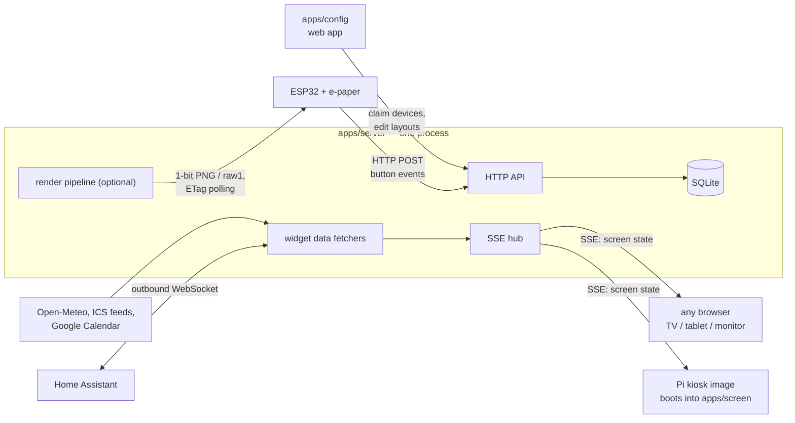
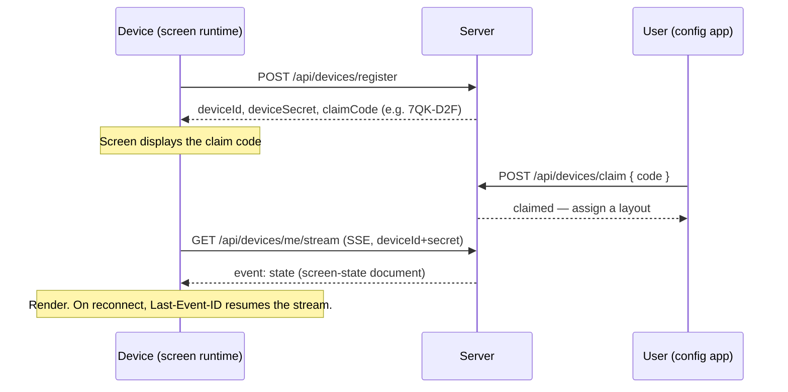

# Architecture

## 1. The reframe: an appliance platform, not a kernel

"An OS for every screen" does not mean writing an operating system. It means owning the **experience** an OS owns: power → glass, with nothing in between. Engineering-wise, GlanceOS is an appliance platform:

- **One server** that is the single source of truth: devices, layouts, widget data, integrations.
- **Thin screen runtimes** that are stateless renderers — *dumb glass*. They hold no settings, no business logic, no API keys. They render what the server tells them and nothing else.

Every credible product in this space (TRMNL, DAKboard, signage platforms) converges on this shape, because it is what makes "no settings on the device" natural rather than a limitation. The bootable Pi image (P3) is "the OS" in the marketing sense; in this document it is just packaging around the screen runtime.

Dumb, **not amnesiac**: a screen caches the last state it was given (and its device identity). A Wi-Fi blip or a server restart must never blank a wall display — the clock keeps ticking locally and a subtle staleness indicator appears until the connection returns.

## 2. System overview



### Responsibilities — and non-responsibilities

| Component | Does | Must never do |
|---|---|---|
| `apps/server` | Device registry & pairing, layout CRUD + validation, widget data fetching/caching, SSE push, e-ink rendering, user auth | Render UI, know about specific display hardware |
| `apps/screen` | Render a screen-state document to DOM; show claim code when unclaimed; cache last state | Call third-party APIs, hold secrets, contain business logic, use a framework |
| `apps/config` | Claim flow, form-based layout editor, integration setup | Render dashboard widgets (that's `screen`'s job), touch the DB directly |
| `packages/schema` | Define every shared shape (zod), export inferred types + JSON Schema | Contain runtime logic |
| `devices/pi-image` | Boot to `apps/screen` in a kiosk browser; first-boot Wi-Fi provisioning | Store layouts or settings; anything a stock screen wouldn't do |
| `devices/esp32-eink` | Fetch pre-rendered image, draw, sleep; report button presses | Render layouts itself, parse the layout schema |

A structural rule that falls out of this: **screens never talk to third parties.** All external data (weather, calendars, Home Assistant) is fetched server-side. Devices need zero API keys, CORS never enters the picture, and the e-ink renderer reuses the exact same data.

## 3. Schema-first design

The layout is a document, and the schema (in `packages/schema`, written in zod) is the project's real API. The rule:

> **If the schema can't express it, the feature doesn't exist.**

Every renderer — live DOM, 1-bit e-paper, anything future — consumes the same document. Since v2 (DECISIONS 021) a board is **document flow**: a list of lines, each holding 1–4 blocks side by side with relative widths. Screens don't scroll, so lines share the glass height (divider-only lines stay thin). An example layout:

```json
{
  "schemaVersion": 2,
  "name": "Personal dashboard",
  "theme": { "mode": "light" },
  "gap": 2,
  "rows": [
    { "id": "r1", "blocks": [
      { "id": "w1", "type": "clock",   "width": 1, "props": { "showDate": true } },
      { "id": "w2", "type": "weather", "width": 1, "props": { "latitude": 28.61, "longitude": 77.21 } }
    ]},
    { "id": "r2", "blocks": [
      { "id": "w3", "type": "calendar", "width": 1, "props": { "source": "ics", "url": "https://example.com/cal.ics", "maxEvents": 5 } },
      { "id": "w4", "type": "tasks",    "width": 1, "props": { "listId": "default" } }
    ]},
    { "id": "r3", "blocks": [
      { "id": "w5", "type": "text", "width": 1, "props": { "content": "Drink water." } }
    ]}
  ]
}
```

`schemaVersion` is bumped on breaking schema changes and old documents are migrated on read (see `packages/schema/src/migrate.ts`) — v1 grid documents and v2 height-less rows both convert transparently to current v3. Four golden layouts live as fixtures in `packages/schema` and seed the hub as GlanceOS builtins. The block library is 46 types (DECISIONS 022); the time and nature blocks (clocks, countdowns, moon phase, sun times) compute on the screen from the local clock, so they need no server fetcher.

### Device profiles

A layout describes intent; a **device profile** describes the glass it lands on:

```json
{ "width": 800, "height": 480, "colorDepth": "mono", "refresh": { "mode": "poll", "intervalSeconds": 900 } }
```

Live screens report `{ "refresh": { "mode": "sse" } }`. The renderer adapts the same layout to the profile (type scale, mono palette, refresh cadence) instead of users maintaining one layout per device.

## 4. Widget model

A widget type is a triple:

1. **Schema** (`packages/schema`): the `props` shape, validated everywhere.
2. **Server-side fetcher** (`apps/server`): turns props into display data on a cadence (Open-Meteo every 15 min, ICS every 5 min, clock data is client-local). Fetchers cache by input so ten screens with the same city cost one upstream call.
3. **Client renderer** (`apps/screen`): a hand-rolled `mount / update / destroy` interface — deliberately a micro-framework, not React.

v0.1 widget set: `clock`, `calendar` (ICS), `weather` (Open-Meteo, keyless), `tasks` (server-local list), `text`, `queue` (clinic "now serving" board; an operator bumps it from a phone page in P4).

What a screen actually receives is a **screen-state document** — layout plus the data the fetchers prepared:

```json
{
  "layoutVersion": 14,
  "layout": { "schemaVersion": 2, "name": "Personal dashboard", "gap": 2, "rows": ["..."] },
  "data": {
    "w2": { "temperatureC": 26.4, "summary": "clear" },
    "w3": { "events": [ { "start": "2026-06-12T10:00:00+05:30", "title": "Class" } ] }
  }
}
```

## 5. Device identity & pairing

Modeled on the OAuth 2.0 Device Authorization Grant ([RFC 8628](https://datatracker.ietf.org/doc/html/rfc8628)) — the same flow TVs use for "go to example.com and enter this code", which is exactly the right UX for a screen with no input.



Key property: **the claim code is rendered by the screen runtime itself.** The Pi image and the ESP32 firmware never implement pairing UI — an unclaimed device simply displays what the server (or its local runtime) tells it to, which keeps every runtime dumb.

Claiming binds the device to the claiming **account** (DECISIONS 018) and deliberately assigns no layout: "claimed, pick a setup" is a first-class state, and the config studio's picker decides what the screen shows. Setups are decoupled from screens — forgetting a screen keeps its setup, and one setup can drive any number of screens (they all update on the same `pushDevicesUsingLayout` fan-out).

Identity is `deviceId` (UUID) + `deviceSecret`, issued at registration, stored device-side, sent on every request. Unclaimed devices can only poll their own claim status — they see nothing else.

## 6. Data flow

```
config app edit
  → zod validation (packages/schema, shared with the editor for inline errors)
  → persist to SQLite
  → bump layoutVersion
  → SSE `state` event to subscribed live screens
  → e-ink devices pick it up at next poll (ETag mismatch → new image)
  → screen renders, caches state locally
```

The `layoutVersion` is the concurrency token end to end: it is the SSE event id, the ETag for polled renders, and the staleness check after reconnect.

## 7. Transports: SSE, polling, and one outbound WebSocket

**Push to screens is SSE — only.** Server-Sent Events are unidirectional, which is all dumb glass needs; `EventSource` reconnects automatically with `Last-Event-ID` for free; and it's plain HTTP, so old TV browsers and reverse proxies are happy. A WebSocket server adds bidirectional plumbing nothing here uses.

- **Live screens (browser, Pi):** `GET /api/devices/me/stream`, SSE.
- **Battery devices (e-ink):** HTTP polling with `If-None-Match: <layoutVersion+dataHash>`; `304` costs almost nothing and the radio goes back to sleep. Push is meaningless to a device that is unconscious 99% of the time.
- **Button presses (P5):** plain `POST /api/devices/me/events` from the device. No socket needed.
- **The one WebSocket** is *outbound from the server* to Home Assistant (P4), because that's HA's native API for live entity state.

## 8. E-ink render pipeline + device protocol (shipped — DECISIONS 026)

```
headless Chromium (Playwright) opens apps/screen?preview=1 at the device profile
  → postMessage the composed screen-state, screenshot at native panel resolution
  → grayscale (sharp)
  → Floyd–Steinberg dither (hand-written — apps/server/src/render/dither.ts)
  → 1-bit BMP            (most e-paper libs decode this directly)
  → or ?format=raw1      (packed 1-bit framebuffer; MCU draws it without a decoder)
  → or ?format=png       (grayscale preview for the dashboard / debugging)
```

Because this renders the *same* screen runtime, e-ink output is a screenshot of the truth, not a parallel implementation — an e-paper panel and a TV show the same board. The dither and BMP/raw1 encoders are pure and unit-tested; Chromium is the only heavy part, so the render endpoint returns `503` with install instructions when it's absent and CI stays light.

A battery device speaks a tiny documented protocol ([DEVICE-API.md](DEVICE-API.md)): register once, then per wake `GET /api/devices/me/display` (reports battery/RSSI/firmware, returns an `image_url` + `refresh_rate`) and fetch the image, then deep-sleep. Any firmware, any self-hosted server. **Playlists** rotate a screen through several setups (the current item is `floor(now/interval) % n`, so SSE browsers and polled devices agree without coordination), and the **`jsonFeed`** block polls any JSON URL and renders a safe `{{dotted.path}}` template — a code-free "private plugin".

## 9. Offline & caching behavior

| Situation | Behavior |
|---|---|
| Wi-Fi blip, live screen | Keep rendering cached state; clock ticks locally; subtle stale dot after 60 s |
| Server restart | `EventSource` auto-reconnects; `Last-Event-ID` → full state replay if behind |
| E-ink device misses polls | Last image persists physically (e-paper holds without power) — degrade gracefully by design |
| Fresh boot, no network | Screen shows provisioning instructions (Pi: captive-portal AP; browser: URL hint) |

## 10. Deployment

One process in development (`pnpm dev`), one Docker container in production, SQLite on a volume. LAN-first: the assumed install is a home server / spare machine on the same network as the screens. No external services are required for core function — Open-Meteo and ICS feeds are outbound-only and optional.

## 11. Non-goals (the scope fence)

- **No kernel or distro work.** The Pi image is stock Raspberry Pi OS Lite + a kiosk stage, full stop.
- **No app store, no third-party plugin API** before 1.0. Widget types are in-tree.
- **No Android/Tizen/webOS native apps.** A TV's browser pointed at a URL is the TV story.
- **No cross-instance hub federation.** Multi-user accounts and template sharing live *within* one deployment (DECISIONS 018/019); a global registry across installs is a separate product. The layout *document* itself stays user-free — ownership is a row property, never part of the schema.
- **No speaker, no microphone, no assistant, no notifications.** Calm is the product.

## 12. Deliberately open questions

Logged here so they don't get decided by accident:

- LAN TLS story (mkcert? plain HTTP with honest threat-model docs?) — decide in P3.
- Multi-user/auth model beyond single password — revisit at P4 when integrations hold OAuth tokens.
- Widget plugin API (out-of-tree widgets) — only after the in-tree interface survives P5 unchanged.
- A second e-ink target (6" 758×1024 e-reader panels via IT8951) — v2 BOM question, not a v1 question.
